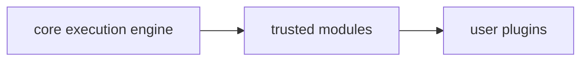
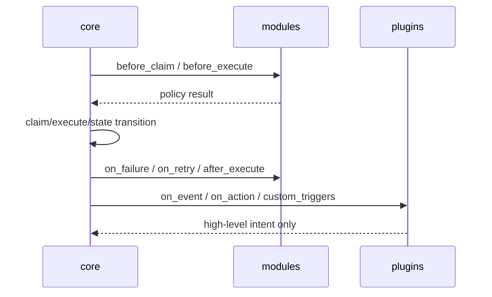

# Extension Hooks Architecture

This document defines a minimal extension model for the current runtime split:

- `core` = execution engine
- `modules` = trusted extensions
- `plugins` = marketplace/user extensions

The goal is to keep the runtime stable while separating trusted system hooks from user-facing hooks.

## Architecture Principle

Flow is strictly one-way:


ф
Rules:

- `core` orchestrates execution and owns state transitions
- `modules` can influence execution policy through system hooks
- `plugins` can react to events and request high-level actions only
- `plugins` never call the executor directly
- `plugins` never mutate operation state directly
- `plugins` never create attempts directly

## Two Hook Types

### 1. System Hooks

System hooks are for trusted `modules/` only.

Hooks:

- `before_claim`
- `before_execute`
- `on_failure`
- `on_retry`
- `after_execute`

Responsibilities:

- change retry policy decisions
- enrich execution context
- attach metadata
- veto or defer execution within approved policy rules

System hook contract should be small and deterministic. Hooks return a hook result, not arbitrary state mutations.

Suggested result shape:

```python
@dataclass(frozen=True)
class SystemHookResult:
    allow: bool = True
    retry_policy_override: dict[str, Any] | None = None
    context_patch: dict[str, Any] | None = None
    reason: str | None = None
```

### 2. User Hooks

User hooks are for `plugins/` and are intentionally limited.

Hooks:

- `on_event`
- `on_action`
- `custom_triggers`

Responsibilities:

- observe execution/events
- react to user-visible actions
- request high-level workflows
- schedule or emit user-level intents

Suggested result shape:

```python
@dataclass(frozen=True)
class UserHookResult:
    handled: bool = False
    actions: list[dict[str, Any]] = field(default_factory=list)
    note: str | None = None
```

## Boundary Between Modules and Plugins

### Modules

Trusted modules may:

- inspect execution context
- influence retry decisions
- register system hooks
- call internal services exposed by core
- read approved read-only snapshots

### Plugins

Plugins may only:

- subscribe to user hooks
- emit intents through the limited SDK
- read their own plugin configuration
- receive approved event snapshots

Plugins may not:

- call executor internals
- mutate `Operation.status`
- create `Attempt` records
- access raw storage directly
- call internal services outside the SDK

## Limited Plugin SDK

Plugins should get a high-level SDK, not the runtime object.

Suggested surface:

```python
class PluginSDK(Protocol):
    async def emit_event(self, event_type: str, payload: dict[str, Any]) -> None: ...
    async def request_action(self, action_type: str, payload: dict[str, Any]) -> dict[str, Any]: ...
    async def register_trigger(self, trigger_name: str, spec: dict[str, Any]) -> None: ...
    async def get_config(self) -> dict[str, Any]: ...
    async def log(self, level: str, message: str, **fields: Any) -> None: ...
```

Recommended high-level actions:

- `request_action("execution.retry", {...})`
- `request_action("execution.cancel", {...})`
- `request_action("notification.send", {...})`
- `request_action("integration.invoke", {...})`

The SDK must not expose:

- `executor`
- direct storage handles
- raw claim/attempt mutation
- direct operation persistence

## Security Model

### Sandbox Execution

Plugins run in a sandboxed boundary:

- limited API surface
- no direct object graph access to core internals
- isolated process or isolated host boundary when available
- explicit allowlist for capabilities

### Timeouts

Each plugin hook invocation must have a bounded timeout.

Suggested defaults:

- `on_event`: short timeout
- `on_action`: medium timeout
- `custom_triggers`: short timeout

If timeout expires:

- hook is marked failed or skipped
- core continues safely
- execution state remains owned by core

### No Direct Storage Access

Plugins must not read or write raw storage.

Instead:

- core exposes sanitized snapshots
- SDK provides only approved read/write actions
- storage access is mediated by core or modules

## Execution Flow



Flow order:

1. `core` decides and mutates execution state
2. `modules` can adjust policy before and after execution
3. `plugins` observe and request high-level actions through SDK

## Hook Placement

### System Hooks → Modules

Examples:

- retry policy module
- execution policy module
- credential rotation policy module
- integration reconciliation module

### User Hooks → Plugins

Examples:

- Telegram bot plugin
- notification plugin
- custom automation plugin

### Mixed Pattern

Automation rule split:

- `module` computes trusted policy and decides whether an action is eligible
- `plugin` handles user-facing notification or external delivery

## Concrete Examples

### Retry Policy = Module

- hook: `on_retry`
- trusted code adjusts retry delay, backoff, or deny/allow retry
- core still owns state transition

### Telegram Bot = Plugin

- hook: `on_event`
- plugin receives event snapshot and emits a message intent
- plugin cannot retry an execution itself

### Automation Rule = Module + Plugin

- module: evaluates conditions in `before_execute` and `on_retry`
- plugin: sends the user-facing notification or posts to a chat system

## Minimal API Contract

### System Hook API

```python
class SystemHook(Protocol):
    async def before_claim(self, ctx: ExecutionContext) -> SystemHookResult: ...
    async def before_execute(self, ctx: ExecutionContext) -> SystemHookResult: ...
    async def on_failure(self, ctx: ExecutionContext) -> SystemHookResult: ...
    async def on_retry(self, ctx: ExecutionContext) -> SystemHookResult: ...
    async def after_execute(self, ctx: ExecutionContext) -> SystemHookResult: ...
```

### User Hook API

```python
class UserHook(Protocol):
    async def on_event(self, event: dict[str, Any], sdk: PluginSDK) -> UserHookResult: ...
    async def on_action(self, action: dict[str, Any], sdk: PluginSDK) -> UserHookResult: ...
    async def custom_triggers(self, trigger: dict[str, Any], sdk: PluginSDK) -> UserHookResult: ...
```

## Constraints

- keep runtime behavior unchanged
- do not add direct executor access to plugins
- do not expose raw storage to plugins
- keep modules trusted and plugins untrusted
- prefer read-only snapshots over mutable shared objects

## Summary

The architecture is intentionally strict:

- `core` owns execution
- `modules` own trusted execution policy hooks
- `plugins` own user-facing reactions and intents
- all user extensions go through a limited SDK and a sandbox boundary
